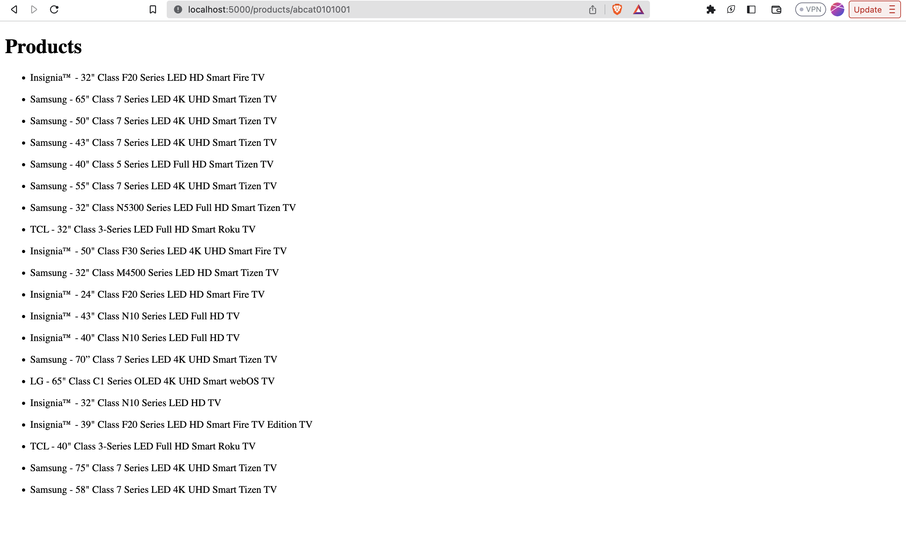

## Catalog Service

#### This service is responsible for managing the catalog of products. It is a simple service that uses a MongoDB database to store the products.


#Images of the service
[]: # 
[]: # 


## How to run the service

### Prerequisites

- Python
- MongoDB
- Flask

### Steps

1. Clone the repository
    ```bash
    git clone https://github.com/govindgoel/catalog-service
    ```
2. Install the dependencies
    ```bash
    pip install -r requirements.txt
    ```
3. Run the service
    ```bash
    python app.py
    ```

### API Endpoints

- GET /shop/products
- GET /shop/categories
- POST /syncData

### Requests & Response Sample


```bash
POST 'http://localhost:5000/syncData'
```

```bash
Headers:
- x-access-token: Required
```

```bash
{
    "message": "Success"
}
```


```bash
GET 'http://localhost:5000/shop/products'
```

```bash
Params: 
- page: 1 (default)
- limit: 100 (default)
Headers:
- x-access-token: Required
```

```bash
{
    "categories": [
        {
            "customerReviewCount": 13315,
            "description": null,
            "digital": false,
            "images": [
                {
                    "href": "https://pisces.bbystatic.com/image2/BestBuy_US/images/products/1260/1260042_sa.jpg"
                }
            ],
            "name": "HP - 61 2-Pack Standard Capacity Ink Cartridges - Black & Tri-Color",
            "salePrice": 51.99,
            "shippingCost": 0,
            "sku": 1260042
        },
        ],
    "page": 1,
    "total_pages": 188
}
```

```bash 
GET 'http://localhost:5000/shop/categories'
```
```bash
Params: 
- page: 1 (default)
- limit: 100 (default)
- categoryID: Required
Headers:
- x-access-token: Required
```

```bash
{
    "categories": [
        {
            "id": "abcat0101001",
            "name": "All Flat-Screen TVs"
        },
        {
            "id": "abcat0106001",
            "name": "TV Stands"
        }
    ],
    "page": 1,
    "total_pages": 48
}
```


